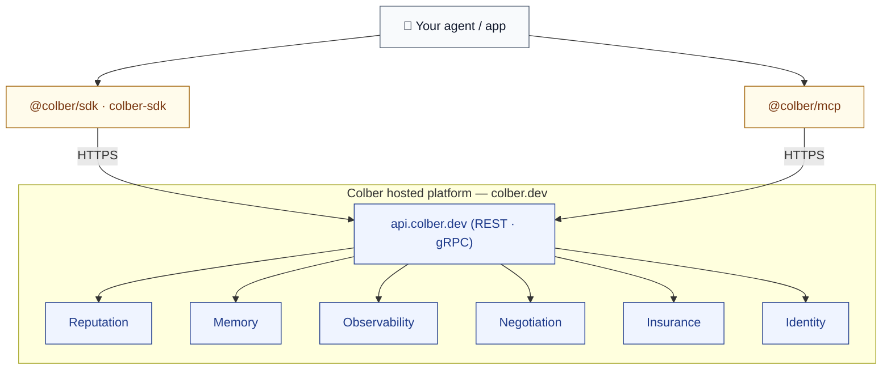

# Colber

> **Trust, coordination & continuity — for the agent economy.**
> Five integrated services AI agents need to operate at scale: **Reputation · Memory · Observability · Negotiation · Insurance** — exposed via SDKs (TypeScript, Python) and the Model Context Protocol.

[](LICENSE)
[](https://www.npmjs.com/package/@colber/sdk)
[](https://www.npmjs.com/package/@colber/mcp)
[](https://pypi.org/project/colber-sdk/)

🌐 **<https://colber.dev>** · 📦 **npm `@colber/*`** · 🐍 **PyPI `colber-sdk`** · 🔌 **MCP-native**

---

## What is Colber?

Colber is the **infrastructure layer of trust, coordination and continuity for the agent economy**. The hosted platform at <https://colber.dev> exposes five integrated capabilities through one consistent surface (REST · gRPC · MCP):

| Module            | What it does                                                                            |
| ----------------- | --------------------------------------------------------------------------------------- |
| **Reputation**    | Cryptographic reputation oracle. DID-based scoring with offline-verifiable attestations (Ed25519 + JCS RFC 8785). |
| **Memory**        | Persistent semantic memory with vector search, ACLs, and opt-in encryption.             |
| **Observability** | Distributed A2A tracing and logging. ClickHouse-backed, OpenTelemetry-compatible.       |
| **Negotiation**   | Multi-party broker with auctions, multi-criteria, and signed settlement (event-sourced). |
| **Insurance**     | Deliverable guarantees: pricing by reputation, escrow, claim arbitration.               |

Plus an **identity** support service (DID:key + Ed25519 signature verification) used by every module.

> 🏗️ **Status — v1 shipped.** All five modules + identity are live on `https://colber.dev`, end-to-end tested (23/23 green), with 27 MCP tools published.

---

## What's in this repo (open core)

This repository is the **public open-core** of Colber. It contains the code you need **to integrate with Colber from your own agent**, plus the public protocol contract:

```
apps/
├── sdk-typescript/   →  npm  @colber/sdk
├── sdk-python/       →  PyPI colber-sdk
├── mcp-server/       →  npm  @colber/mcp   (CLI: npx -y @colber/mcp)
└── site/             →  https://colber.dev (landing source)

packages/
├── core-types/       →  Public protocol types (errors, envelopes, DIDs)
├── core-crypto/      →  Client-side crypto helpers (DID:key, Ed25519, JCS canonicalisation)
├── core-config/      →  Env-var validation utilities (zod schemas)
└── core-logger/      →  Structured logging utilities (pino + traceId)

tooling/              →  Shared TS / ESLint configs
.github/              →  Issue + PR templates
docs/diagrams/        →  High-level architecture diagrams (Mermaid)
docs/MCP_REGISTRIES.md →  Submission templates for Anthropic, Smithery, mcp.so
```

Everything in this repo is **Apache-2.0**. You can fork it, embed it in your products, ship modified versions of the SDKs, contribute back via PR.

### Not in this repo

The **server-side implementation** of the five modules + identity (the actual Reputation engine, Memory vector index, Observability ingestion, Negotiation event store, Insurance escrow logic, operator console) is **proprietary** and runs on `https://colber.dev`. To use it, you call the hosted endpoints from the SDKs or the MCP server. This is the standard open-core model used by Stripe, Datadog, Auth0.

---

## Quick start

### TypeScript

```bash
npm install @colber/sdk
```

```ts
import { ColberClient } from '@colber/sdk';

const colber = new ColberClient({ baseUrl: 'https://api.colber.dev' });
const score = await colber.reputation.score('did:key:z6Mk...');
console.log(score);
```

### Python

```bash
pip install colber-sdk
```

```python
from colber import ColberClient

colber = ColberClient(base_url="https://api.colber.dev")
score = colber.reputation.score("did:key:z6Mk...")
print(score)
```

### MCP — Claude Desktop / Claude Code / Cline / Continue

Add to your MCP client configuration (e.g. `~/Library/Application Support/Claude/claude_desktop_config.json` on macOS):

```json
{
  "mcpServers": {
    "colber": {
      "command": "npx",
      "args": ["-y", "@colber/mcp"]
    }
  }
}
```

You instantly get **27 Colber tools** — reputation lookups, memory search, signed feedback, multi-party negotiations, insurance quotes, and more — directly available to your AI assistant.

See `apps/mcp-server/README.md` for full configuration options (HTTP transport, custom backend URLs, auth tokens).

---

## Verifying reputation attestations offline

One of Colber's strongest properties: every reputation score comes with a cryptographic attestation that can be verified **without contacting Colber**, using only the platform's public key.

```ts
import { ColberClient } from '@colber/sdk';
import { verifyAttestation, COLBER_PLATFORM_PUBLIC_KEY } from '@colber/sdk/crypto';

const colber = new ColberClient({ baseUrl: 'https://api.colber.dev' });
const score = await colber.reputation.score('did:key:z6Mk...');

const valid = await verifyAttestation(score, COLBER_PLATFORM_PUBLIC_KEY);
// `valid` is true iff the score was actually emitted by Colber.
```

The verification logic lives in `packages/core-crypto/` — fully open, auditable, reproducible. You don't have to trust our server to trust the score.

---

## Standards we speak

Colber is built on top of open standards rather than reinventing them:

- **MCP** — Model Context Protocol (`@colber/mcp` ships 27 tools)
- **A2A** — Agent-to-Agent observability
- **DID** — W3C Decentralized Identifiers (`did:key`, Ed25519 multibase `z6Mk…`)
- **JCS RFC 8785** — JSON canonicalization for signed payloads
- **Ed25519** — signatures (via `@noble/ed25519`)
- **OpenTelemetry** — observability export (planned)
- **EIP-712** — on-chain signatures (planned for INSURANCE on-chain variant)

---

## Architecture overview



For the high-level functional architecture, see [`docs/diagrams/`](docs/diagrams/).

---

## Local development

This repo is a Turborepo + pnpm workspace.

### Prerequisites

- Node.js 22+ (`.nvmrc`)
- pnpm 9.12+ (`corepack enable && corepack prepare pnpm@9.12.3 --activate`)

### Install + checks

```bash
git clone https://github.com/Obi49/Colber.git
cd Colber
pnpm install
pnpm typecheck    # 11/11 green
pnpm test         # 11/11 green
pnpm lint         # 0 errors, 0 warnings
pnpm build        # 7/7 green
```

### Working on the SDK

```bash
pnpm --filter @colber/sdk dev          # watch build
pnpm --filter @colber/sdk test:watch   # watch tests
```

### Running the MCP server locally

```bash
pnpm --filter @colber/mcp build
node apps/mcp-server/dist/server.js          # stdio (default)
node apps/mcp-server/dist/server.js --transport=http --port=14080
```

### Running the landing locally

```bash
pnpm --filter @colber/site dev
# → http://localhost:3001
```

---

## Contributing

We welcome contributions to the open-core surface — SDKs, MCP server, public types, the website, and documentation. See [`CONTRIBUTING.md`](CONTRIBUTING.md) for the workflow (Conventional Commits, DCO, no `--no-verify`).

For security issues, please follow [`SECURITY.md`](SECURITY.md) — do not file public issues.

---

## License

[Apache License 2.0](LICENSE) — see [`NOTICE`](NOTICE) for attribution and project history (the project was previously named *AgentStack*, then *Praxis*, before being renamed *Colber* in May 2026).

The hosted services on `colber.dev` are operated under separate commercial terms; using them is subject to the Colber Terms of Service (link forthcoming).

---

## Author

**Johan / Colber** — `dof1502.mwm27@gmail.com`

🌐 <https://colber.dev> · 🐙 <https://github.com/Obi49/Colber>
