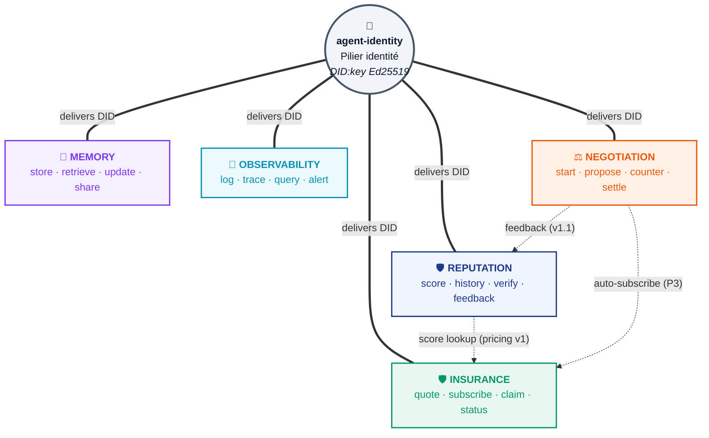

# Praxis

> **Plateforme d'infrastructure pour l'économie agentique.**
> Cinq services intégrés pour agents IA autonomes : **Insurance · Reputation · Observability · Negotiation · Memory** — tous exposés en MCP + REST + gRPC.

Praxis se positionne comme la couche de **trust, coordination & continuity** au-dessus des rails de paiement A2A (MoonPay, Coinbase x402, Nevermined). Là où ces acteurs gèrent la transaction monétaire, Praxis fournit ce qui permet aux agents IA de **se faire confiance**, **négocier**, **garantir leurs livrables**, **tracer leurs interactions** et **se souvenir entre sessions**.

> Projet initialement nommé _AgentStack_ (cahier des charges v1.0). Renommé **Praxis** définitivement en avril 2026.

---

## 🎯 Statut — v1 ATTEINTE (5/5 modules livrés)

**Date** : 2026-04-28 · **Branche active** : `main` · **Dernier commit** : `77612f6`

| Module                                               | Statut | Tests | Service VM β            | Ports         | DB                                           |
| ---------------------------------------------------- | ------ | ----- | ----------------------- | ------------- | -------------------------------------------- |
| [`agent-identity`](apps/agent-identity/) (support)   | ✅ v1  | 21    | `praxis-agent-identity` | 14001 / 14002 | `praxis_identity`                            |
| [`reputation`](apps/reputation/)                     | ✅ v1  | 62    | `praxis-reputation`     | 14011 / 14012 | `praxis_reputation`                          |
| [`memory`](apps/memory/)                             | ✅ v1  | 78    | `praxis-memory`         | 14021 / 14022 | `praxis_memory`                              |
| [`observability`](apps/observability/)               | ✅ v1  | 32    | `praxis-observability`  | 14031 / 14032 | `praxis_observability` + ClickHouse `praxis` |
| [`negotiation`](apps/negotiation/)                   | ✅ v1  | 61    | `praxis-negotiation`    | 14041 / 14042 | `praxis_negotiation`                         |
| [`insurance`](apps/insurance/) (mode simulation MVP) | ✅ v1  | 54    | `praxis-insurance`      | 14051 / 14052 | `praxis_insurance`                           |

**Pipeline FULL TURBO** : 16/16 typecheck/test/lint, 11/11 build, **385 tests passing** (4 skipped placeholders live).
**E2E sur VM β** (`100.83.10.125`) : `python .tools/e2e_smoke.py` → **23/23 steps verts**.

> 💡 **INSURANCE est en mode simulation pure pour la v1** : pas de Solidity, pas de Foundry, pas de viem, pas de Base Sepolia. La version on-chain réelle (smart contracts, escrow Base L2, audit Trail of Bits) est l'étape 7b en P3. Décision validée CdP.

> 📄 **État détaillé** : [docs/STATUS.md](docs/STATUS.md) · **Plan d'attaque** : [docs/ROADMAP.md](docs/ROADMAP.md)

---

## 🏗️ Vision et architecture

### 5 modules + 1 service support



| Module            | Rôle                                                    | Stockage primaire                           |
| ----------------- | ------------------------------------------------------- | ------------------------------------------- |
| **REPUTATION**    | Oracle de fiabilité agentique avec attestations crypto  | Neo4j + Postgres + ancrage on-chain (P3)    |
| **MEMORY**        | Mémoire externe persistante avec recherche sémantique   | Qdrant 1.15 + Postgres + Ollama embeddings  |
| **OBSERVABILITY** | Logging/tracing distribué A2A                           | ClickHouse + Postgres                       |
| **NEGOTIATION**   | Broker de négociation A2A multi-parties (event-sourced) | Postgres (event store + projection)         |
| **INSURANCE**     | Garantie de livrable agentique avec escrow              | Postgres (escrow simulé en v1; on-chain P3) |

**Schémas complémentaires** : [vue plateforme complète](docs/diagrams/praxis-functional.md) · [workflow A2A séquence](docs/diagrams/praxis-workflow-a2a.md) · [workflow par phases](docs/diagrams/praxis-workflow-phases.md) · [tous les schémas](docs/diagrams/).

Détails techniques : [docs/ARCHITECTURE_BREAKDOWN.md](docs/ARCHITECTURE_BREAKDOWN.md) (modèle C4 + WBS + SLO).

### Effet de plateforme

Là où les concurrents sont focalisés sur **un seul** module (MoonPay/x402 = paiement, Mem0/Letta/Zep = mémoire, Datadog = observability humaine), Praxis offre les **5 modules intégrés** mais commercialisables séparément. Fenêtre stratégique 12-24 mois avant qu'un acteur établi (Stripe/Coinbase/AWS) bundle l'ensemble.

---

## 🚀 Quick start

### Prérequis

- Node.js 22+ (cf. `.nvmrc`)
- pnpm 9.12.3+ (corepack `pnpm@9.12.3`)
- Docker 27+ et Docker Compose 2.30+
- Python 3.11+ avec `cryptography` pour les tests E2E

### Installation et tests locaux

```bash
git clone https://github.com/Obi49/Praxis.git
cd Praxis
pnpm install
pnpm typecheck   # 16/16 verts
pnpm test        # 385 tests passing
pnpm lint        # 0 erreur
pnpm build       # 11/11 verts
```

### Lancer la stack β en local (Docker)

```bash
cd praxis-stack
docker compose -f docker-compose.yml -f docker-compose.services.yml up -d
```

Voir [docs/DEPLOY.md](docs/DEPLOY.md) pour le runbook complet.

### Tests E2E contre une VM déployée

```bash
PRAXIS_VM=<ip_de_la_vm> python .tools/e2e_smoke.py
```

23/23 steps verts attendus.

---

## 🧰 Stack technique

| Couche               | Choix                                                       |
| -------------------- | ----------------------------------------------------------- |
| **Backend**          | TypeScript / Node 22 + Rust (modules crypto critiques P3)   |
| **Framework HTTP**   | Fastify v5 (zod validation, helmet, cors, sensible)         |
| **gRPC**             | `@grpc/grpc-js` + `@grpc/proto-loader` (proto JSON-encoded) |
| **MCP**              | `@praxis/core-mcp` interne (registry-style)                 |
| **ORM Postgres**     | drizzle-orm + postgres-js (migrations versionnées)          |
| **Vecteurs**         | Qdrant 1.15.4                                               |
| **OLAP / logs**      | ClickHouse 24.10                                            |
| **Graphe**           | Neo4j 5 community                                           |
| **Embeddings**       | Ollama self-hosted (`nomic-embed-text` 768d)                |
| **Cache**            | Redis 7                                                     |
| **Bus événements**   | NATS JetStream 2.10 (réservé futur)                         |
| **Métriques**        | Prometheus + Grafana                                        |
| **Reverse proxy**    | Traefik v3 (interne)                                        |
| **Build / monorepo** | Turborepo 2 + pnpm workspaces                               |
| **Tests**            | Vitest 2 + fastify.inject (`InMemory*` fakes)               |
| **Lint / format**    | ESLint v9 flat config + Prettier 3 + Husky                  |
| **Crypto**           | `@noble/ed25519` v2.3 + JCS RFC 8785                        |
| **Identité**         | DID method `did:key` (Ed25519 multibase z6Mk…)              |
| **TS strict**        | `exactOptionalPropertyTypes` + `noUncheckedIndexedAccess`   |

### Standards interopérables

MCP, A2A, x402, OpenTelemetry (export OTLP en P2), DID, Verifiable Credentials, EIP-712 (P3 on-chain).

### Roadmap on-chain (P3)

- **Base L2 (Coinbase)** comme L2 primaire — escrow INSURANCE, signatures NEGOTIATION, ancrage REPUTATION.
- **Optimism / Arbitrum** en multi-chain / fallback.
- **USDC** (Circle) comme stablecoin de référence.

---

## 📁 Structure du repo

```
Praxis/
├── apps/                          # Services applicatifs (5 modules + agent-identity)
│   ├── agent-identity/            # Bootstrap crypto, DID:key, register/resolve/verify
│   ├── reputation/                # Scoring + attestations Ed25519+JCS
│   ├── memory/                    # Vector store + permissions + versioning
│   ├── observability/             # Logs/spans ClickHouse + alerts Postgres
│   ├── negotiation/               # Event sourcing + auctions + multi-party signing
│   └── insurance/                 # Pricing + escrow simulé + claims (mode v1)
│
├── packages/                      # Packages partagés (workspace)
│   ├── core-types/                # Erreurs typées, codes, enveloppe API
│   ├── core-crypto/               # Ed25519, fromBase64, signature provider
│   ├── core-config/               # zod env schemas réutilisables
│   ├── core-logger/               # pino structuré + traceId
│   └── core-mcp/                  # MCP server abstrait + registry tools
│
├── tooling/                       # Configurations centralisées
│   ├── tsconfig/                  # Base TS + node-app TS configs
│   └── eslint-config/             # Flat config v9 partagée
│
├── praxis-stack/                  # Stack Docker β
│   ├── docker-compose.yml         # Datastores + infra (postgres, redis, neo4j, ...)
│   ├── docker-compose.services.yml# Services applicatifs (build + up)
│   └── services.env               # Secrets dev (gitignoré sur la VM)
│
├── .tools/                        # Scripts de pilotage local
│   ├── ssh_run.py                 # Exécution SSH paramiko (sudo via stdin)
│   ├── ssh_push.py                # SFTP push avec mkdir tree
│   └── e2e_smoke.py               # Tests E2E des 5 services + identity
│
├── docs/                          # Documentation projet (toute la doc en un endroit)
│   ├── AgentStack_Cahier_des_charges.docx  # CDC v1.0 figé (ancien nom AgentStack)
│   ├── PLAN_DE_DEVELOPPEMENT.md   # 5 phases / 32 sprints / gates / KPI
│   ├── ARCHITECTURE_BREAKDOWN.md  # Modèle C4 + WBS + SLO + sécurité
│   ├── STATUS.md                  # Snapshot état projet (mis à jour à chaque pause)
│   ├── ROADMAP.md                 # Plan d'attaque + briefs prêts pour agents
│   ├── ONBOARDING.md              # Guide reprise de session (humain ou agent)
│   ├── DEPLOY.md                  # Runbook déploiement VM β
│   └── DESIGN_BRIEF.md            # Brief Claude Design pour les schémas
│
└── README.md                      # Ce fichier (point d'entrée GitHub)
```

---

## 📚 Documentation et reprise

### Pour comprendre le projet (ordre recommandé)

1. **[README.md](README.md)** (ce fichier) — vue d'ensemble, statut, quick start.
2. **[docs/ONBOARDING.md](docs/ONBOARDING.md)** — **point d'entrée pour reprendre une session** (humain ou agent IA).
3. **[docs/STATUS.md](docs/STATUS.md)** — état projet à l'instant T (modules livrés, infra, tests, décisions, points d'attention).
4. **[docs/ROADMAP.md](docs/ROADMAP.md)** — plan d'attaque opérationnel + **briefs prêts à coller** dans des agents dev.
5. **[docs/ARCHITECTURE_BREAKDOWN.md](docs/ARCHITECTURE_BREAKDOWN.md)** — décomposition technique modèle C4.
6. **[docs/PLAN_DE_DEVELOPPEMENT.md](docs/PLAN_DE_DEVELOPPEMENT.md)** — découpage en 5 phases sur 18 mois.
7. **[docs/AgentStack_Cahier_des_charges.docx](docs/AgentStack_Cahier_des_charges.docx)** — spécifications fonctionnelles et techniques v1.0 (figé, ancien nom).
8. **[docs/DEPLOY.md](docs/DEPLOY.md)** — runbook de déploiement VM β.
9. **[docs/DESIGN_BRIEF.md](docs/DESIGN_BRIEF.md)** — prompt prêt à coller dans Claude Design pour les schémas (fonctionnel + workflow A2A).

### Workflow de collaboration (PM ↔ agents dev)

Voir [docs/ONBOARDING.md](docs/ONBOARDING.md) §"Workflow validé". Résumé :

1. Le **chef de projet (CdP)** rédige un brief complet pour un agent dev (`backend-development:backend-architect`).
2. L'agent code (~30 min, ~50 fichiers cohérents).
3. Le CdP vérifie : `pnpm build && pnpm typecheck && pnpm test && pnpm lint`.
4. Commit + push (Conventional Commits + co-author Claude).
5. Déploiement VM : pull + docker build + up + healthcheck.
6. E2E `python .tools/e2e_smoke.py` → tout vert.
7. Update STATUS + ROADMAP + push final.

**Doctrine** : jamais de `--no-verify`, push à chaque grosse étape, doc avant pause.

---

## 🛣️ Prochaines étapes possibles

Toutes optionnelles, ordre à arbitrer selon priorités business — cf. [docs/ROADMAP.md](docs/ROADMAP.md) :

- **Étape 2** — OBSERVABILITY v1.1 : anomalies ML (IQR/EWMA/Z-score) + tiering S3 + exporter OTLP.
- **Étape 3** — REPUTATION v2 : multi-dim (delivery/quality/communication) + anti-Sybil (Louvain/Leiden via Neo4j GDS) + workflow contestation.
- **Étape 4** — Plugins frameworks : `@praxis/langchain-plugin`, `@praxis/crewai-plugin`, `@praxis/autogen-plugin`.
- **Étape 5** — Console opérateur web (Next.js 15 + React 19 + Tailwind v4).
- **Étape 6** — SDK officiels : `@praxis/sdk` (TS sur npm), `praxis-sdk` (Python sur PyPI).
- **Étape 7b** — INSURANCE on-chain réel : Solidity + Foundry + viem + Base Sepolia → mainnet. **Audit Trail of Bits ou OpenZeppelin obligatoire avant prod.**
- **Étape 8b** — NEGOTIATION v1.1 : cancellation + sweeper deadline + LLM mediator + EIP-712 + insurance/reputation bridges.
- **Étape 9** — GA publique : bug bounty Immunefi (smart contracts) + HackerOne (web/API) + audit sécu tiers + self-service ouvert.
- **Étape 10** — P4 industrialisation : multi-région (US, APAC) + enterprise (SSO SAML, SCIM, MSA/DPA) + standardisation (RFC public protocole de réputation).

---

## 🔐 Sécurité

- **PAT GitHub** : utilisé pour push depuis l'environnement local. Le PAT actuel dans `.env.local` est considéré compromis (a transité en clair en session précédente). **À régénérer en fine-grained scopé `Obi49/Praxis` uniquement** avant la prochaine session sensible.
- **Clés platform Ed25519** + **clé AES MEMORY_ENCRYPTION_KEY** : fixtures de DEV stockées dans `praxis-stack/services.env` (sur la VM uniquement, gitignoré). À régénérer pour tout autre environnement.
- **Auth endpoints memory v1** : `callerDid`/`queryDid` en clair (pas de signature). À durcir en P2.
- **PCI / KYC / AML** : non applicable au MVP simulation. Devient critique avec INSURANCE on-chain (étape 7b).

Pour les détails sécurité-conformité prévus en GA (RGPD, audit trail, AI Act anticipation, bug bounty) : [docs/ARCHITECTURE_BREAKDOWN.md §4](docs/ARCHITECTURE_BREAKDOWN.md).

---

## 📜 Licence

`UNLICENSED` (privé, propriétaire). Voir le `package.json` racine.

---

## ✍️ Auteur

**Johan** — Chef de projet — `dof1502.mwm27@gmail.com`

Repo : <https://github.com/Obi49/Praxis>
