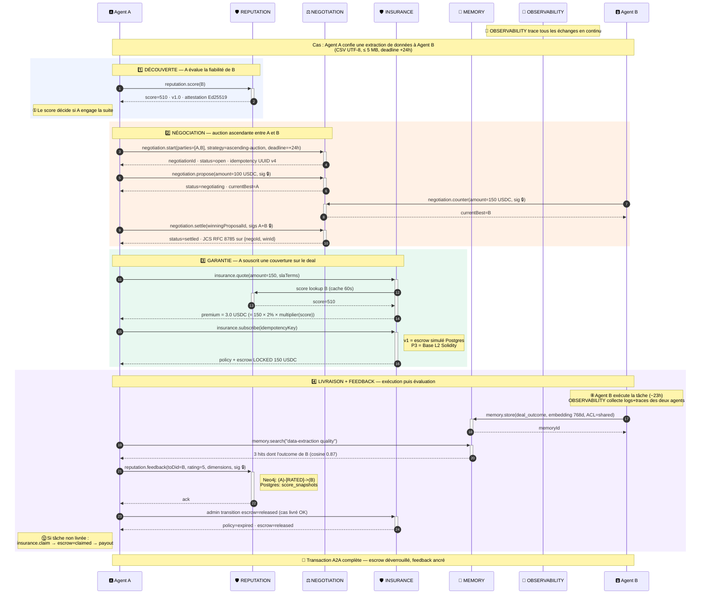

# Colber — workflow A2A (diagramme de séquence)

> Cas d'usage concret : Agent A confie une extraction de données à Agent B (CSV UTF-8, ≤ 5 MB, deadline +24h). Lifecycle complet sur les 5 modules.
> Le sens des messages est explicite (Mermaid sequence diagram) — pas d'ambiguïté.

## Légende

| Symbole               | Signification                                                                             |
| --------------------- | ----------------------------------------------------------------------------------------- |
| `->>`                 | **Requête** (call) — flèche pleine, l'appelant attend une réponse                         |
| `-->>`                | **Réponse** (return) — flèche pointillée, retour du destinataire                          |
| `+/-` sur participant | Activation/désactivation — montre la durée de traitement côté destinataire                |
| 🔒                    | Signature cryptographique Ed25519 + JCS RFC 8785 sur le payload canonicalisé              |
| `Note over X,Y`       | Annotation entre acteurs (contexte, contrainte temporelle, etc.)                          |
| `rect rgb(...)`       | Phase métier teintée (DÉCOUVERTE / NÉGOCIATION / GARANTIE / LIVRAISON+FEEDBACK)           |
| 🅰️ / 🅱️               | Pastille initiateur (juste pour la lisibilité — l'autonumber ① ② ③ … indique la séquence) |

## Conventions cryptographiques

Tous les échanges Agent → modules avec `🔒` sont signés en **Ed25519 + JCS RFC 8785** :

- `negotiation.propose` / `counter` / `settle` : signatures sur le payload canonicalisé.
- `negotiation.settle` : signatures **multi-parties** de toutes les `partyDids` sur `{negotiationId, winningProposalId}`.
- `reputation.feedback` : signature unique sur le payload canonicalisé.

**Idempotency** via UUID v4 sur `negotiation.start`, `insurance.subscribe`, `insurance.claims`. Replay → 200 + même ressource.

**On-chain** : aucun appel en v1 (mode simulation). Ancrage Base L2 et signatures EIP-712 prévus en P3 après audit Trail of Bits / OpenZeppelin.

## Variantes

| Variante                                         | Cible                                         |
| ------------------------------------------------ | --------------------------------------------- |
| **Sequence diagram détaillé** (ce fichier)       | Doc technique, onboarding développeur         |
| [Phases horizontales](colber-workflow-phases.md) | Slide synthétique, page d'accueil, pitch deck |
