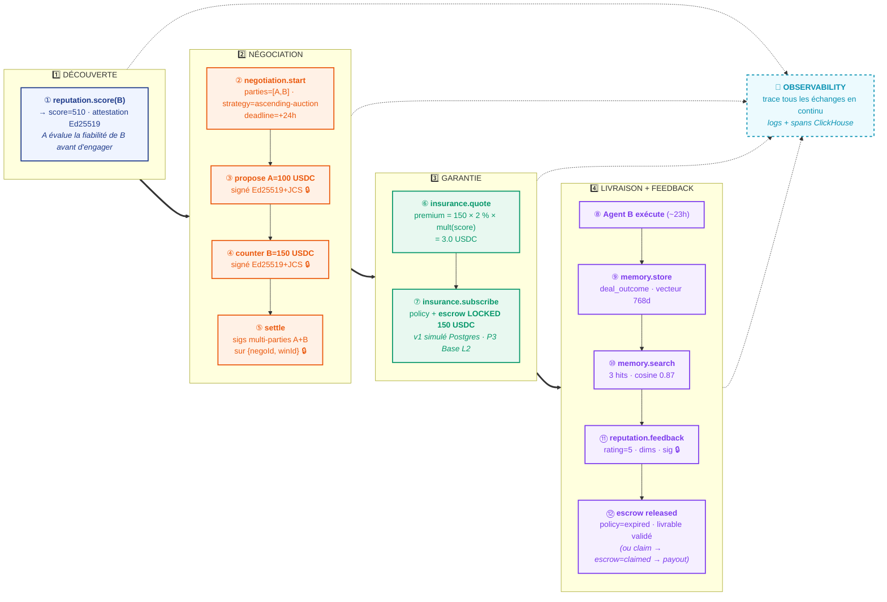

# Colber — workflow A2A par phases (vue synthétique horizontale)

> Variante synthétique du workflow A2A : 4 phases lisibles d'un coup d'œil.
> Pour la version détaillée avec sequence diagram, voir [colber-workflow-a2a.md](colber-workflow-a2a.md).

## Lecture du schéma

Le **temps avance de gauche à droite**. Chaque phase regroupe les étapes du sequence diagram détaillé selon leur rôle métier.

| Phase                   | Étapes du sequence diagram | Module dominant                 |
| ----------------------- | -------------------------- | ------------------------------- |
| 1️⃣ Découverte           | ①                          | REPUTATION                      |
| 2️⃣ Négociation          | ② ③ ④ ⑤                    | NEGOTIATION                     |
| 3️⃣ Garantie             | ⑥ ⑦                        | INSURANCE                       |
| 4️⃣ Livraison + Feedback | ⑧ ⑨ ⑩ ⑪ ⑫                  | MEMORY + REPUTATION + INSURANCE |

**OBSERVABILITY trace en continu** sur l'ensemble du flux (toutes les phases) — logs et spans ingérés dans ClickHouse, disponibles via `observability.query`.

## Avantages vs sequence diagram détaillé

|                                  | Phases horizontales (ce fichier) | Sequence diagram détaillé     |
| -------------------------------- | -------------------------------- | ----------------------------- |
| **Lisibilité au premier regard** | ✅ Excellente                    | ⚠️ Demande lecture verticale  |
| **Compréhension flux global**    | ✅ Évidente (gauche → droite)    | ⚠️ Implicite                  |
| **Détail des payloads**          | ❌ Synthétique                   | ✅ Chaque message visible     |
| **Direction des appels**         | ❌ Implicite                     | ✅ Explicite (->>vs-->>)      |
| **Public cible**                 | Pitch, slide, page d'accueil     | Doc technique, onboarding dev |

> 💡 Les deux schémas sont complémentaires. La phase est la "carte" — le sequence est le "manuel".
