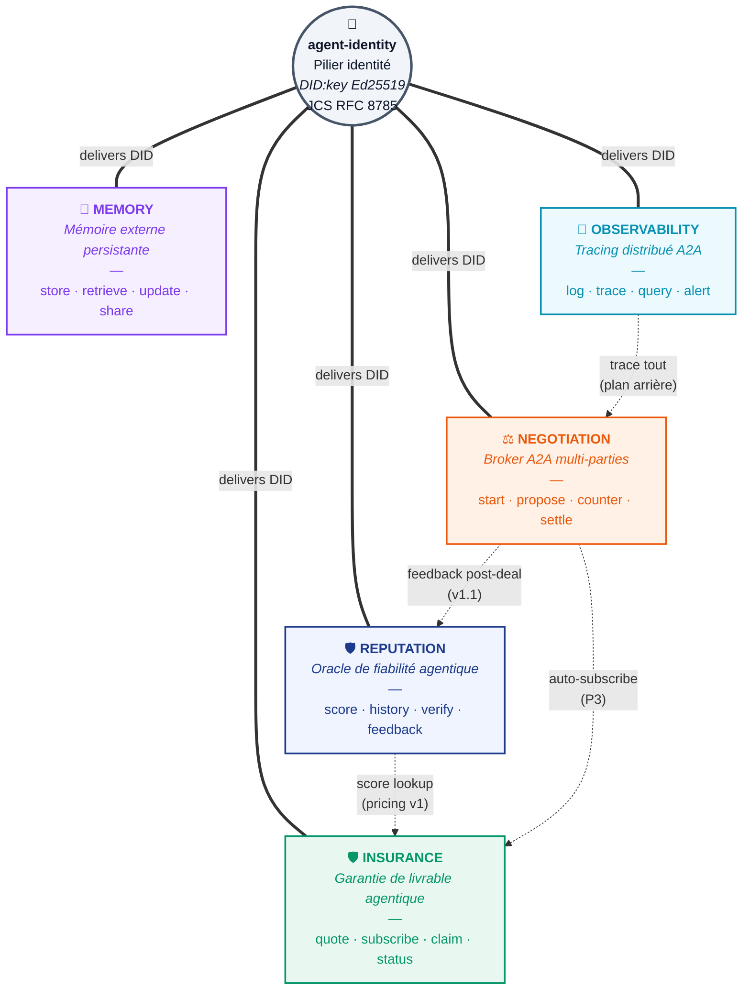

# Praxis — schéma fonctionnel (variante hub & spoke)

> Variante "marketable" du schéma fonctionnel : `agent-identity` au centre comme pilier transverse, les 5 modules en pétales radiaux. Idéal pour slide hero / pitch deck.
> Pour la version technique alignée avec endpoints, voir [praxis-functional.md](praxis-functional.md).

## Lecture du schéma

- **Au centre** : `agent-identity`, le pilier transverse. **Tous** les modules délèguent l'identité à ce service. C'est le seul service qui n'a pas besoin lui-même de signatures inbound — il les fournit aux autres.
- **Les 5 pétales** : les 5 modules métier de Praxis. Chacun expose 4 endpoints MCP (et leurs équivalents REST + gRPC). Chacun a une couleur d'identité unique cohérente dans toute la documentation.
- **Les arcs en pointillés** : synergies inter-modules. La seule active en v1 est `REPUTATION → INSURANCE` (lookup score pour le pricing). Les autres sont des intégrations futures (P3 on-chain, v1.1 bridges).

## Effet de plateforme

> **5 modules intégrés** mais commercialisables séparément.
>
> Là où les concurrents sont focalisés sur **un seul** module (MoonPay/x402 = paiement, Mem0/Letta/Zep = mémoire, Datadog = observability humaine), Praxis offre les **5 modules connectés** autour d'une identité agentique unifiée.
>
> Chaque module gagne en valeur composée à chaque ajout — fenêtre stratégique 12-24 mois avant qu'un acteur établi (Stripe / Coinbase / AWS) bundle l'ensemble.

## Quand utiliser cette variante

| Cas d'usage             | Variante recommandée                                                |
| ----------------------- | ------------------------------------------------------------------- |
| Slide hero pitch deck   | **Hub & spoke** (ce fichier) — plus visuel, plus parlant            |
| Page d'accueil site web | **Hub & spoke** (ce fichier)                                        |
| Doc technique / README  | [Grille fonctionnelle](praxis-functional.md) — alignement endpoints |
| Onboarding développeur  | [Grille fonctionnelle](praxis-functional.md)                        |
