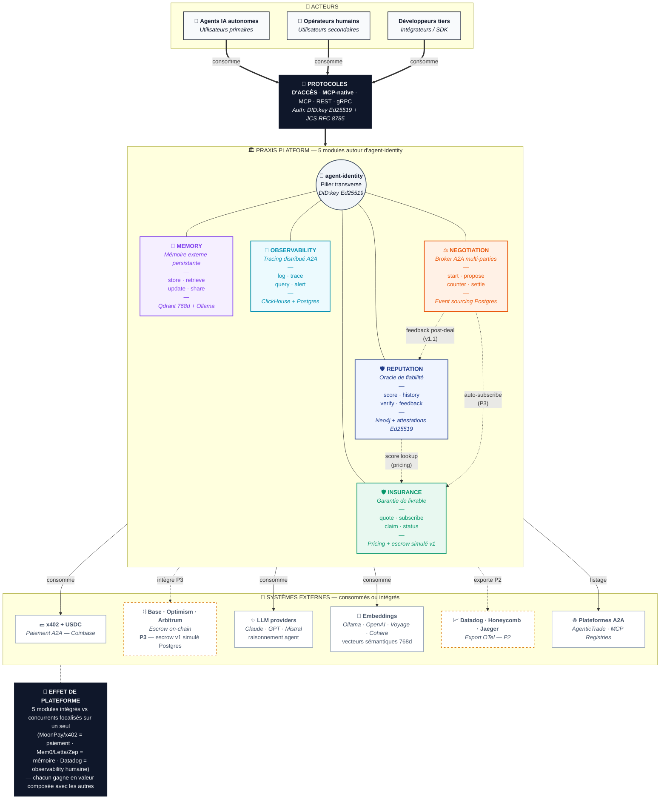

# Praxis — schéma fonctionnel (vue plateforme)

> Vue d'ensemble : acteurs → protocoles d'accès → 5 modules + agent-identity → systèmes externes intégrés.
> Rendu natif par GitHub. Édition par modification du bloc Mermaid ci-dessous.

## Légende

| Couleur   | Module           | Statut                                      |
| --------- | ---------------- | ------------------------------------------- |
| 🔵 Bleu   | REPUTATION       | v1 livré                                    |
| 🟣 Violet | MEMORY           | v1 livré                                    |
| 🩵 Cyan   | OBSERVABILITY    | v1 livré                                    |
| 🟠 Orange | NEGOTIATION      | v1 livré                                    |
| 🟢 Vert   | INSURANCE        | v1 livré (mode simulation — on-chain en P3) |
| ⚫ Gris   | `agent-identity` | v1 livré (pilier transverse)                |

**Conventions de flèches :**

- `==>` (épaisses) : flux INBOUND — acteurs consomment Praxis
- `-->` (simples) : flux OUTBOUND — Praxis intègre/consomme/exporte
- `-.->` (pointillées) : intégrations non encore actives en v1 (P2, P3)
- `---` (sans tête) : lien d'appartenance (modules ↔ pilier identité)
- `-.->` (avec label) entre modules : synergies inter-modules (futurs ou v1)

**Référence visuelle :** voir aussi [praxis-functional-hub.md](praxis-functional-hub.md) pour la variante hub & spoke (slide hero / pitch deck).
